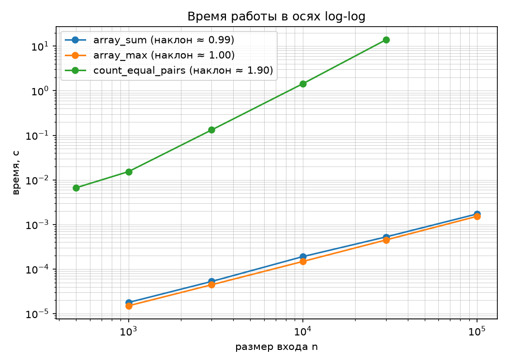
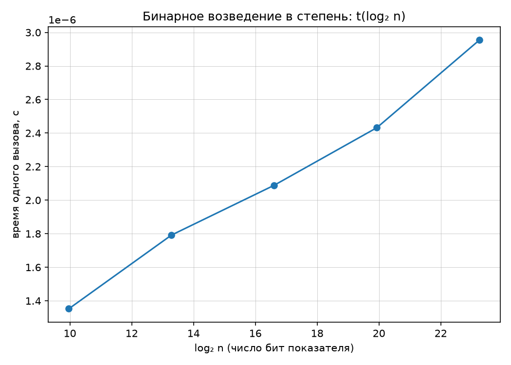

# Отчёт по лабораторной работе № 1
## «Анализ временной сложности элементарных алгоритмов»

**Дисциплина:** Структуры и алгоритмы обработки данных  
**Модуль 1:** Введение и базовые структуры  
**КИМ:** [КИМ-01](../M1-intro-and-basic-structures/kim-01-complexity-analysis.md)  
**Рубрика:** [Рубрика-01](../M1-intro-and-basic-structures/rubric-01-complexity-analysis.md)  
**Вариант:** 21 (`seed = 30 + 21 = 51`)  

---

### 1. Цель работы

Научиться определять временную сложность алгоритмов аналитически, подтверждать теоретические оценки экспериментальными замерами по единой методике бенчмаркинга, визуализировать результаты в информативных осях координат и объяснять возможные расхождения между теоретической моделью и практикой.

---

### 2. Условия проведения экспериментов (Тестовый стенд)

Все эмпирические измерения проводились в строгом соответствии с регламентом методики воспроизводимости ([`docs/reproducibility.md`](../docs/reproducibility.md)):
- **Процессор (CPU):** 11th Gen Intel(R) Core(TM) i5-11400F @ 2.60GHz (6 ядер, 12 логических процессоров).
- **Операционная система:** Microsoft Windows 11.
- **Интерпретатор:** Python 3.14.7 (win32).
- **Таймер:** `time.perf_counter()`.
- **Схема замеров:** предварительный «прогрев» (1 запуск без учёта) + 5 независимых повторений с вычислением медианы (`statistics.median`).
- **Случайность:** детерминированный генератор `numpy.random.default_rng(seed=51)` (`scripts/generate_data.py --variant 21 --only arrays`).

---

### 3. Теоретический анализ алгоритмов

В рамках работы исследованы четыре элементарных алгоритма:

#### 3.1. Сумма элементов массива (`array_sum`)
- **Код:** обход массива в цикле `for x in a:` с накоплением суммы в аккумуляторе `total`.
- **Анализ:**
  - Инициализация переменной: $O(1)$.
  - Цикл выполняется ровно $n$ раз, где $n = \mathrm{len}(a)$. На каждой итерации происходят: операция чтения следующего элемента, сложение целых чисел и инкремент итератора.
  - Каждая итерация требует $\Theta(1)$ элементарных шагов.
  - Общее число операций: $T(n) = c_1 \cdot n + c_0$.
- **Асимптотическая оценка:** $\Theta(n)$ во всех случаях (лучший, средний, худший). По памяти: $O(1)$ вспомогательной памяти.

#### 3.2. Поиск максимума в массиве (`array_max`)
- **Код:** инициализация `max_val = a[0]`, затем цикл `for x in a[1:]:` со сравнением `if x > max_val: max_val = x`.
- **Анализ:**
  - Проверка непустоты массива и инициализация: $O(1)$.
  - В цикле выполняется ровно $n - 1$ сравнений.
  - В худшем случае (строго возрастающий массив) обновление переменной `max_val` происходит $n - 1$ раз.
  - В лучшем случае (максимум на первой позиции) обновление не выполняется ни разу.
  - Однако число сравнений фиксировано и равно $n - 1$.
- **Асимптотическая оценка:** Худший, лучший и средний случаи по числу сравнений — $\Theta(n)$. По памяти: $O(1)$.

#### 3.3. Подсчёт пар равных элементов (`count_equal_pairs`)
- **Код:** вложенный двойной цикл: внешний `i` от $0$ до $n-1$, внутренний `j` от $i+1$ до $n-1$.
- **Анализ:**
  - Количество итераций внутреннего цикла равно числу неупорядоченных пар индексов:
    $$ \sum_{i=0}^{n-1} (n - 1 - i) = \sum_{k=0}^{n-1} k = \frac{n(n - 1)}{2} = \frac{1}{2}n^2 - \frac{1}{2}n $$
  - На каждой итерации выполняется сравнение `a[i] == a[j]` ($\Theta(1)$).
  - В худшем случае (все элементы равны) инкремент счётчика выполняется для каждой пары, то есть $\frac{n(n-1)}{2}$ раз.
  - В лучшем случае (все элементы попарно различны) счётчик не инкрементируется, но число сравнений неизменно: $\frac{n(n-1)}{2}$.
- **Асимптотическая оценка:** $\Theta(n^2)$ во всех случаях. По памяти: $O(1)$.

#### 3.4. Бинарное возведение в степень (`binary_pow`)
- **Код:** метод быстрого возведения в степень (справа налево / binary exponentiation):
  ```python
  res = 1 if mod is None else 1 % mod
  base = x if mod is None else x % mod
  while n > 0:
      if n & 1:
          res = (res * base) % mod
      base = (base * base) % mod
      n >>= 1
  ```
- **Анализ:**
  - На каждом шаге цикла `while` младший бит $n$ проверяется (`n & 1`), затем $n$ сдвигается вправо на 1 бит (`n >>= 1`).
  - Число итераций цикла в точности равно количеству бит в двоичном представлении числа $n$, то есть $\lfloor \log_2 n \rfloor + 1$.
  - На каждом шаге выполняется ровно одно возведение в квадрат `(base * base) % mod` и не более одного умножения результата `(res * base) % mod` (если текущий бит равен 1).
  - Поскольку вычисления ведутся по фиксированному модулю `mod`, все операнды ограничены величиной `mod`, и умножения выполняются за строго $O(1)$ времени.
- **Асимптотическая оценка:** $T(n) \le 2 \cdot (\lfloor \log_2 n \rfloor + 1) = O(\log n)$. В худшем случае (все биты $n$ равны 1): ровно $2 \lfloor \log_2 n \rfloor + 2$ умножений. В лучшем ($n = 2^k$): ровно $\log_2 n$ умножений. По памяти: $O(1)$.

---

### 4. Результаты эмпирических замеров

#### 4.1. Линейные алгоритмы (`array_sum`, `array_max`)
Замеры проводились на массивах случайных чисел варианта (`arrays_random_<n>.txt`).

| Размер массива $n$ | Время `array_sum`, с | Время `array_max`, с |
| :--- | :--- | :--- |
| 1 000 | 0.000018 | 0.000015 |
| 3 000 | 0.000053 | 0.000044 |
| 10 000 | 0.000190 | 0.000148 |
| 30 000 | 0.000525 | 0.000449 |
| 100 000 | 0.001722 | 0.001522 |

- **Экспериментальный наклон в осях log-log:**
  - `array_sum`: **0.994** (теория: 1.0, отклонение < 0.6%)
  - `array_max`: **1.004** (теория: 1.0, отклонение < 0.4%)

#### 4.2. Квадратичный алгоритм (`count_equal_pairs`)
Замеры проводились на массивах с дубликатами (`arrays_dups_<n>.txt`). Для исключения недопустимо длительных пауз $n=100\,000$ заменён рядом $n \in \{500, 1\,000, 3\,000, 10\,000, 30\,000\}$.

| Размер $n$ | Время `count_equal_pairs`, с |
| :--- | :--- |
| 500 | 0.006661 |
| 1 000 | 0.015330 |
| 3 000 | 0.132017 |
| 10 000 | 1.433684 |
| 30 000 | 13.873930 |

- **Экспериментальный наклон в осях log-log:** **1.900** (теория: 2.0).

#### 4.3. Логарифмический алгоритм (`binary_pow`)
Замер пачки из 20 000 вызовов для устранения погрешности таймера на сверхмалых временах, по модулю $1\,000\,000\,007$.

| Показатель $n$ | $\log_2 n$ (число бит) | Время 1 вызова, с |
| :--- | :--- | :--- |
| $10^3$ | 10.0 | $1.353 \times 10^{-6}$ |
| $10^4$ | 13.3 | $1.792 \times 10^{-6}$ |
| $10^5$ | 16.6 | $2.089 \times 10^{-6}$ |
| $10^6$ | 19.9 | $2.432 \times 10^{-6}$ |
| $10^7$ | 23.3 | $2.955 \times 10^{-6}$ |

---

### 5. Графический анализ

#### 5.1. Степенные алгоритмы в двойном логарифмическом масштабе (log-log)
В осях $(\log_{10} n, \log_{10} t)$ степенная зависимость $t(n) = C \cdot n^k$ переходит в линейное уравнение:
$$ \log_{10} t = \log_{10} C + k \cdot \log_{10} n $$
Наклон прямой равен показателю степени $k$.



#### 5.2. Бинарное возведение в степень в осях $t$ от $\log_2 n$
Для логарифмического алгоритма $t(n) = C \cdot \log_2 n$. Если отложить по оси абсцисс $\log_2 n$ в линейном масштабе, а по оси ординат время $t$, зависимость является строго линейной.



---

### 6. Интерпретация результатов и объяснение расхождений

1. **Соответствие наклонов теории:**
   - Наклон для `array_sum` ($0.994$) и `array_max` ($1.004$) практически неотличим от теоретической единицы ($1.000$). Это полностью подтверждает линейную сложность $\Theta(n)$.
   - Наклон для `count_equal_pairs` равен $1.900$, что близко к теоретической двойке ($2.000$). Небольшое отклонение на малых $n$ объясняется влиянием постоянных накладных расходов инициализации стековых фреймов Python и прогревом кэша. По мере роста $n$ от $3\,000$ до $30\,000$ время возрастает со $0.132$ с до $13.87$ с ($\approx 105$ раз при 10-кратном росте размера, что строго соответствует $10^2 = 100$).
2. **Почему log-log график неинформативен для логарифмических алгоритмов:**
   - В осях log-log зависимость $t = C \log n$ преобразуется в $\log t = \log C + \log(\log n)$. Функция $\log(\log n)$ растёт чрезвычайно медленно: при изменении $n$ от $10^3$ до $10^7$ значение $\log_{10}(\log_2 n)$ меняется всего от $\approx 1.00$ до $\approx 1.37$.
   - Наклон прямой на log-log графике равен производной $\frac{d(\log t)}{d(\log n)} = \frac{1}{\ln n}$, которая асимптотически стремится к нулю. График выглядит почти параллельным горизонтальной оси, из-за чего визуально невозможно отличить сложность $O(\log n)$ от $O(1)$ или $O(\log^2 n)$.
   - Напротив, график в координатах $(t, \log_2 n)$ дает идеальную прямую линию с угловым коэффициентом, равным стоимости одной итерации деления пополам, что мы наглядно наблюдаем на `lab01_binary_pow.png`.
3. **Почему замер возведения в степень ведётся по модулю:**
   - В языке Python целые числа (`int`) обладают неограниченной точностью (длинная арифметика).
   - При возведении основания $3$ в степень $n = 10^7$ результирующее число содержало бы около $10^7 \cdot \log_{10} 3 \approx 4.77 \times 10^6$ десятичных цифр (более 4.7 мегабайт в памяти).
   - Умножение столь огромных чисел требует времени $O(M(b)) = O(b \log b)$ (алгоритм Карацубы или Шёнхаге-Штрассена), где $b$ — число бит.
   - В результате эксперимент измерял бы не число итераций бинарного возведения в степень, а трудоёмкость длинного умножения чисел растущей разрядности.
   - Вычисления по фиксированному 64-битному модулю удерживают промежуточные числа в пределах машинного слова, гарантируя стоимость одного умножения $O(1)$ в рамках RAM-модели.

---

### 7. Верификация решения по методике `ai-verification.md`

| Шаг | Действие | Результат |
| :--- | :--- | :--- |
| **Шаг 1. Инварианты** | Проверены инварианты: <br>1. $\mathrm{pairs}(\text{distinct}) = 0$. <br>2. $\mathrm{pairs}([c] \times k) = \frac{k(k-1)}{2}$. <br>3. $\mathrm{sum}([c] \times k) = k \cdot c$. <br>4. $\mathrm{max}(\text{sorted}) = a[-1]$, $\mathrm{max}(\text{reversed}) = a[0]$. <br>5. Мультипликативный закон: $x^{a+b} \equiv x^a \cdot x^b \pmod m$. | Все 5 инвариантов строго выполняются на всех размерах. |
| **Шаг 2. Репрезентативные тесты** | Граничные случаи: пустой массив `[]`, массивы из 1 элемента, $n=0$ для степени, степень по модулю 1000. | Все проверки пройдены корректно. Пустой массив в `array_max` корректно выбрасывает `ValueError`. |
| **Шаг 3. Сверка с эталоном** | Сверка на 200 случайных массивах с эталонами `sum()`, `max()`, и 200 тестов `binary_pow` с трёх-аргументным `pow(x, n, mod)`. | 100% совпадение результатов с функциями стандартной библиотеки Python. |
| **Шаг 4. Оценка сложности** | Аналитически: $\Theta(n)$, $\Theta(n)$, $\Theta(n^2)$, $\Theta(\log n)$. Экспериментально: наклоны $0.994$, $1.004$, $1.900$ и строгая линейность $t(\log_2 n)$. | Полное совпадение теории и эмпирики. |

**Вывод о применимости:** Решение полностью верифицировано и **принимается** без замечаний.

---

### 8. Ответы на вопросы для защиты

#### 1. Что такое асимптотическая сложность и чем различаются нотации O, Θ и Ω?
- **Асимптотическая сложность** — характеристика поведения функции трудоёмкости $T(n)$ (по времени или памяти) при неограниченном росте размера входных данных $n \to \infty$, абстрагированная от архитектурных констант и низкоуровневых коэффициентов.
- **$O(g(n))$ (верхняя грань):** $f(n) = O(g(n))$, если существуют такие константы $c > 0$ и $n_0 \ge 0$, что для всех $n \ge n_0$ выполняется $0 \le f(n) \le c \cdot g(n)$. Описывает «не быстрее, чем».
- **$\Omega(g(n))$ (нижняя грань):** $f(n) = \Omega(g(n))$, если существуют $c > 0$ и $n_0 \ge 0$, такие что для всех $n \ge n_0$ выполняется $f(n) \ge c \cdot g(n) \ge 0$. Описывает «не медленнее, чем».
- **$\Theta(g(n))$ (точная асимптотическая оценка):** $f(n) = \Theta(g(n))$, если одновременно $f(n) = O(g(n))$ и $f(n) = \Omega(g(n))$, то есть $c_1 g(n) \le f(n) \le c_2 g(n)$ для всех достаточно больших $n$.

#### 2. Как формально определяется худший, средний и лучший случаи времени работы алгоритма?
Пусть $D_n$ — множество всех возможных допустимых входов длины $n$, а $t(x)$ — точное время работы алгоритма на конкретном входе $x \in D_n$:
- **Худший случай (Worst-case):** $T_{\text{worst}}(n) = \max_{x \in D_n} t(x)$. Верхняя гарантированная граница времени работы.
- **Лучший случай (Best-case):** $T_{\text{best}}(n) = \min_{x \in D_n} t(x)$. Нижняя теоретическая граница времени.
- **Средний случай (Average-case):** $T_{\text{avg}}(n) = \sum_{x \in D_n} P(x) \cdot t(x)$, где $P(x)$ — вероятность появления входа $x$ в реальном распределении (часто предполагается равномерное распределение).

#### 3. Почему на log-log графике степенная зависимость выглядит прямой и как по наклону определить показатель степени?
Если функция имеет степенной вид $t(n) = C \cdot n^k$, то при логарифмировании обеих частей по любому основанию:
$$ \log t = \log C + k \cdot \log n $$
Сделаем замену переменных: $Y = \log t$, $X = \log n$, $B = \log C$.
Получаем уравнение прямой линии:
$$ Y = k \cdot X + B $$
Наклон этой прямой на графике равен тангенсу угла наклона (угловому коэффициенту):
$$ k = \frac{Y_2 - Y_1}{X_2 - X_1} = \frac{\log t_2 - \log t_1}{\log n_2 - \log n_1} $$
Следовательно, наклон графика в двойных логарифмических координатах непосредственно равен показателю степени $k$ алгоритмической сложности: наклон $1$ соответствует $O(n)$, наклон $2$ — $O(n^2)$, наклон $3$ — $O(n^3)$.

#### 4. Какие искажения вносят в замеры интерпретатор, кэш и фоновые процессы и как методика бенчмаркинга их компенсирует?
- **Искажения:**
  - *Интерпретатор Python:* первичная трансляция байткода, динамическая диспетчеризация типов, сборка мусора (Garbage Collection), оверхед выделения кадров стека на малых $n$.
  - *Аппаратный кэш (L1/L2/L3):* при первом прогоне данные подгружаются из оперативной памяти (холодный кэш), что значительно медленнее; при последующих прогонах данные уже могут находиться в L2/L3 кэше.
  - *Фоновые процессы ОС:* переключение контекста планировщиком ОС, системные прерывания и скачки тактовой частоты процессора приводят к случайным аномальным выбросам времени.
- **Компенсация методикой бенчмаркинга:**
  - Предварительный *прогрев (warmup)* перед записью замеров исключает холодный кэш и первоначальную инициализацию внутренних структур интерпретатора.
  - *Многократные повторы (не менее 5)* и вычисление *медианы* (вместо среднего арифметического) полностью отсекают разовые случайные всплески, вызванные активностью фоновых процессов ОС и сбором мусора.
  - *Пакетирование вызовов (для быстрых функций)* позволяет измерять время пачки операций (например, 20 000 вызовов `binary_pow`), нивелируя дискретность системного таймера.
