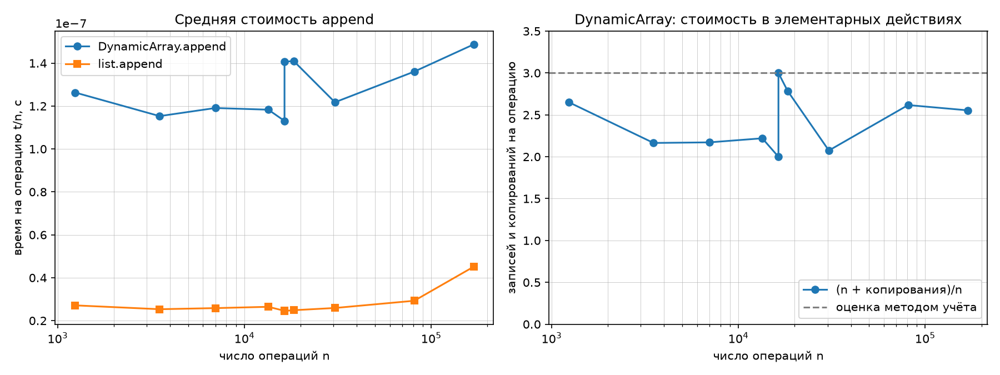
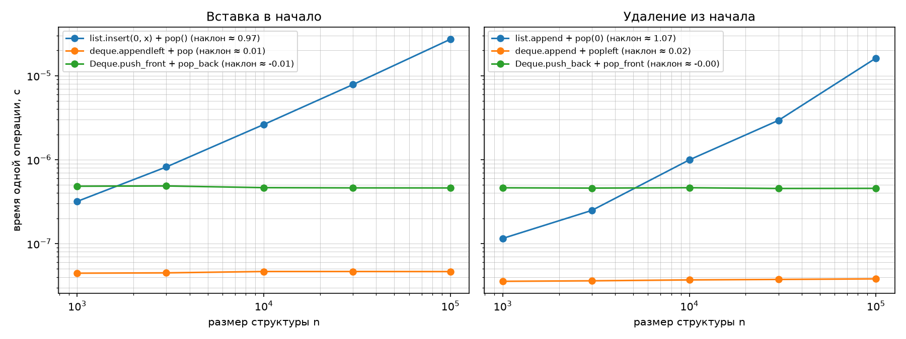

# Отчёт по лабораторной работе № 2
## «Реализация рекурсивных функций и динамического массива, стека и дека»

**Дисциплина:** Структуры и алгоритмы обработки данных  
**Модуль 1:** Введение и базовые структуры  
**КИМ:** [КИМ-02](../M1-intro-and-basic-structures/kim-02-recursion-linear-structures.md)  
**Рубрика:** [Рубрика-02](../M1-intro-and-basic-structures/rubric-02-recursion-linear-structures.md)  
**Вариант:** 21 (`seed = 30 + 21 = 51`)  

---

### 1. Цель работы

Освоить рекурсию как метод проектирования алгоритмов, изучить накладные расходы рекурсивных вызовов и эффект мемоизации; реализовать базовые линейные структуры данных («с нуля» с ручным управлением ёмкостью буфера и на двусвязном списке), экспериментально доказать амортизированную стоимость $O(1)$ для добавления в динамический массив и строгое $O(1)$ для операций на концах дека, а также обосновать результаты методом учёта (банковским методом).

---

### 2. Условия проведения экспериментов (Тестовый стенд)

- **Процессор (CPU):** 11th Gen Intel(R) Core(TM) i5-11400F @ 2.60GHz (6 ядер, 12 логических процессоров).
- **Операционная система:** Microsoft Windows 11.
- **Интерпретатор:** Python 3.14.7 (win32).
- **Таймер:** `time.perf_counter()`.
- **Методика:** предварительный прогрев + 5 повторений с вычислением медианы (`statistics.median`).
- **Тестовые данные варианта:** сгенерированы командой `python scripts/generate_data.py --variant 21 --only ops` (по 100 000 операций над стеком и деком, размеры серий `append`).

---

### 3. Рекурсивные алгоритмы и исследование стоимости

#### 3.1. Реализованные функции
1. **Факториал (`factorial`):**
   - Базовое условие: $n = 0$ или $n = 1 \implies 1$.
   - Рекуррентное соотношение: $T(n) = T(n - 1) + O(1) \implies \Theta(n)$. Глубина стека вызовов: $n$.
2. **Числа Фибоначчи наивно (`fib_naive`):**
   - Базовые условия: $F(0) = 0$, $F(1) = 1$.
   - Переход: $F(n) = F(n - 1) + F(n - 2)$.
   - Рекуррентность для числа вызовов: $C(0) = 1, C(1) = 1$, при $n \ge 2$:
     $$ C(n) = 1 + C(n - 1) + C(n - 2) = 2 \cdot F(n + 1) - 1 $$
   - Сложность по времени: $\Theta(\phi^n)$, где $\phi = \frac{1 + \sqrt{5}}{2} \approx 1.618$ (золотое сечение).
3. **Числа Фибоначчи с мемоизацией (`fib_memo`):**
   - Использует словарь `memo` для сохранения промежуточных результатов.
   - Каждый $k \in [0, n]$ вычисляется ровно один раз.
   - Для каждого $k \ge 2$ функция вызывается один раз на вычисление и один раз на чтение из кэша.
   - Формула числа вызовов: $C_{\text{memo}}(n) = 2n - 1$ (при $n \ge 2$).
   - Сложность по времени: $\Theta(n)$.
4. **Ханойские башни (`hanoi`):**
   - Перенос $n$ дисков со стержня `src` на `dst` с использованием `aux`:
     1. Перенести $n-1$ дисков с `src` на `aux` ($T(n-1)$).
     2. Перенести 1 диск с `src` на `dst` (1 операция).
     3. Перенести $n-1$ дисков с `aux` на `dst` ($T(n-1)$).
   - Рекуррентность: $T(n) = 2T(n - 1) + 1$, $T(0) = 0 \implies T(n) = 2^n - 1$.
   - Алгоритм формирует список ходов и проверяет все ограничения (диск большего размера ни разу не кладётся на меньший, все диски оказываются на целевом стержне).

#### 3.2. Сравнение числа вызовов: наивная рекурсия против мемоизации

| $n$ | $F(n)$ | Вызовов `fib_naive` (Факт) | $2F(n+1) - 1$ (Теория) | Вызовов `fib_memo` (Факт) | $2n - 1$ (Теория) | Отношение вызовов (Ускорение) |
| :--- | :--- | :--- | :--- | :--- | :--- | :--- |
| **5** | 5 | 15 | 15 | 9 | 9 | $\times 1.67$ |
| **10** | 55 | 177 | 177 | 19 | 19 | $\times 9.32$ |
| **15** | 610 | 1 973 | 1 973 | 29 | 29 | $\times 68.0$ |
| **20** | 6 765 | 21 891 | 21 891 | 39 | 39 | $\times 561$ |
| **25** | 75 025 | 242 785 | 242 785 | 49 | 49 | $\times 4 955$ |
| **30** | 832 040 | 2 692 537 | 2 692 537 | 59 | 59 | $\mathbf{\times 45\,636}$ |

Фактическое число вызовов абсолютно точно совпадает с выведенными аналитическими формулами. При $n=30$ мемоизация сокращает число вызовов с 2.69 миллионов до 59 (в 45 636 раз!).

---

### 4. Динамический массив и амортизированный анализ

#### 4.1. Архитектура `DynamicArray`
Класс `DynamicArray` построен поверх непрерывного «сырого» буфера фиксированного размера (`[None] * capacity`):
- Начальная ёмкость: $\mathrm{INITIAL\_CAPACITY} = 4$.
- Инвариант: $0 \le \mathrm{size} \le \mathrm{capacity}$.
- Стратегия роста: при заполнении ($\mathrm{size} == \mathrm{capacity}$) вызывается `_grow()`, выделяющий буфер размера $2 \times \mathrm{capacity}$ и переносящий элементы. Перенесённые элементы подсчитываются в атрибуте `self.copies`.

#### 4.2. Амортизированный анализ методом учёта (банковским методом)

**Постановка задачи:**  
Пусть реальная стоимость элементарной записи нового элемента в свободную ячейку равна $1$ условной единице (монете), а стоимость копирования одного элемента при расширении массива — также $1$ монете.

**Назначение амортизированной (учётной) стоимости:**  
Назначим учётную стоимость операции `append` равной $\hat{c}_i = 3$ монеты.

**Распределение кредита:**
1. **1 монета** расходуется немедленно на реальную запись добавляемого элемента в ячейку буфера.
2. **1 монета** кладётся на сам добавленный элемент как депозитный кредит на его будущее копирование при следующем удвоении.
3. **1 монета** кладётся как депозит на один из ранее добавленных элементов (из первой половины буфера), чей кредит уже был потрачен при предыдущем удвоении.

**Доказательство неотрицательности баланса:**
- Пусть массив только что удвоился до ёмкости $2M$ и содержит $M$ элементов с нулевым кредитом.
- Следующее удвоение произойдёт, когда в массив будет добавлено ещё $M$ элементов, и размер достигнет $2M$.
- За время добавления этих $M$ элементов будет внесено $M \times 3$ монет:
  - $M$ монет потрачено на их непосредственную запись.
  - $2M$ монет накоплено в кредитном балансе банка ($M$ монет на новых элементах и $M$ монет на старых).
- При заполнении буфера до $2M$ для удвоения до $4M$ требуется скопировать ровно $2M$ элементов.
- Накопленный кредит в точности равен $2M$ монетам, что покрывает стоимость копирования без привлечения внешних средств!
- Следовательно, баланс банка в любой момент времени $B_n \ge 0$, а значит, суммарная амортизированная стоимость является строгой верхней границей реальной стоимости:
  $$ \sum_{i=1}^n c_i \le \sum_{i=1}^n \hat{c}_i = 3n \implies \frac{\sum c_i}{n} \le 3 = O(1) $$

#### 4.3. Сопоставление с экспериментальными данными варианта

| $n$ | Время на операцию $t/n$ (DynamicArray), с | Время на операцию $t/n$ (list), с | Копирований `copies` | $\frac{n + \mathrm{copies}}{n}$ |
| :--- | :--- | :--- | :--- | :--- |
| 1 239 | $1.26 \times 10^{-7}$ | $2.71 \times 10^{-8}$ | 2 044 | 2.650 |
| 3 514 | $1.15 \times 10^{-7}$ | $2.53 \times 10^{-8}$ | 4 092 | 2.164 |
| 6 989 | $1.19 \times 10^{-7}$ | $2.58 \times 10^{-8}$ | 8 188 | 2.172 |
| 13 426 | $1.18 \times 10^{-7}$ | $2.64 \times 10^{-8}$ | 16 380 | 2.220 |
| **16 384** ($2^{14}$) | $1.13 \times 10^{-7}$ | $2.46 \times 10^{-8}$ | 16 380 | **2.000** |
| **16 385** ($2^{14}+1$) | $1.41 \times 10^{-7}$ | $2.45 \times 10^{-8}$ | 32 764 | **3.000** |
| 18 341 | $1.41 \times 10^{-7}$ | $2.49 \times 10^{-8}$ | 32 764 | 2.786 |
| 30 502 | $1.22 \times 10^{-7}$ | $2.59 \times 10^{-8}$ | 32 764 | 2.074 |
| 81 056 | $1.36 \times 10^{-7}$ | $2.93 \times 10^{-8}$ | 131 068 | 2.617 |
| 168 667 | $1.49 \times 10^{-7}$ | $4.51 \times 10^{-8}$ | 262 140 | 2.554 |

**Объяснение скачка между $2^k$ и $2^k+1$:**
- При $n = 16\,384 = 2^{14}$ буфер заполнен полностью, суммарное число копирований за все предыдущие расширения (от 4 до 8, 16, ..., 16384) составило $\sum_{i=2}^{13} 2^i = 16\,380$. Среднее число элементарных действий: $\frac{16384 + 16380}{16384} \approx 2.000$.
- При добавлении следующего ($16\,385$-го) элемента буфер переполняется: происходит мгновенное выделение нового буфера размера $32\,768$ и копирование всех $16\,384$ элементов!
- Число копирований возрастает на $16\,384$ и становится равным $32\,764$.
- Значение показателя: $\frac{16385 + 32764}{16385} \approx 3.000$.
- Показатель скачкообразно возрастает ровно на $1$, поскольку ради одной новой вставки пришлось переместить целый массив размера $n$. При дальнейшем заполнении буфера до $32\,768$ показатель плавно снижается обратно к $2.000$. При этом величина $\frac{n + \mathrm{copies}}{n}$ ни в одной точке не превосходит $3$, что наглядно подтверждает теоретическую оценку методом учёта.

---

### 5. Стек и дек: анализ и сравнение с эталонами

#### 5.1. Реализация
- **`Stack`:** реализован поверх `DynamicArray` через методы `append()`, `pop()`, `get(len - 1)`. Обеспечивает строгий LIFO-порядок с амортизированной стоимостью операций $O(1)$.
- **`Deque`:** реализован на классическом двусвязном списке (`_Node`) со ссылками `prev` и `next` и граничными указателями `_head` и `_tail`. Все 4 операции концов (`push_front`, `push_back`, `pop_front`, `pop_back`) выполняются за истинное время $O(1)$ без необходимости амортизации.

#### 5.2. Сравнение операций у начала структур

Измерено время выполнения 1 000 операций вставки/удаления у начала при сохранении общего размера структуры $n$:

| Структура и операция | $n=1\,000$ | $n=3\,000$ | $n=10\,000$ | $n=30\,000$ | $n=100\,000$ | Наклон log-log | Сложность |
| :--- | :--- | :--- | :--- | :--- | :--- | :--- | :--- |
| **`list.insert(0, x) + pop()`** | $3.19 \times 10^{-7}$ | $8.19 \times 10^{-7}$ | $2.63 \times 10^{-6}$ | $7.84 \times 10^{-6}$ | $2.72 \times 10^{-5}$ | **0.97** | $\Theta(n)$ |
| **`deque.appendleft + pop`** | $4.45 \times 10^{-8}$ | $4.49 \times 10^{-8}$ | $4.66 \times 10^{-8}$ | $4.66 \times 10^{-8}$ | $4.65 \times 10^{-8}$ | **0.01** | $\Theta(1)$ |
| **`Deque.push_front + pop_back`**| $4.83 \times 10^{-7}$ | $4.87 \times 10^{-7}$ | $4.65 \times 10^{-7}$ | $4.62 \times 10^{-7}$ | $4.61 \times 10^{-7}$ | **-0.01** | $\Theta(1)$ |
| **`list.append + pop(0)`** | $1.15 \times 10^{-7}$ | $2.49 \times 10^{-7}$ | $9.96 \times 10^{-7}$ | $2.94 \times 10^{-6}$ | $1.62 \times 10^{-5}$ | **1.07** | $\Theta(n)$ |
| **`deque.append + popleft`** | $3.56 \times 10^{-8}$ | $3.61 \times 10^{-8}$ | $3.70 \times 10^{-8}$ | $3.75 \times 10^{-8}$ | $3.81 \times 10^{-8}$ | **0.02** | $\Theta(1)$ |
| **`Deque.push_back + pop_front`**| $4.63 \times 10^{-7}$ | $4.59 \times 10^{-7}$ | $4.64 \times 10^{-7}$ | $4.54 \times 10^{-7}$ | $4.56 \times 10^{-7}$ | **-0.00** | $\Theta(1)$ |

#### 5.3. Почему у `list` наклон около 1, а у деков — около 0
- В стандартном динамическом массиве Python (`list`) элементы хранятся в виде непрерывного массива указателей в виртуальной памяти. При вызове `list.insert(0, x)` или `list.pop(0)` физический сдвиг всех существующих $n$ элементов в памяти вправо/влево обязателен (вызов функции Си `memmove`). Трудоёмкость сдвига пропорциональна числу элементов $n$, поэтому время линейно зависит от размера, а наклон log-log графика равен $0.97 \dots 1.07 \approx 1$.
- В двусвязном списке (`Deque`) добавление элемента в голову сводится к созданию нового объекта узла и перепривязке 2-3 указателей (`new_node.next = self._head`, `self._head.prev = new_node`). Ни один другой узел списка не перемещается и не модифицируется. Трудоёмкость строго не зависит от длины списка $n$, поэтому график горизонтален (наклон $-0.01 \dots 0.02 \approx 0$).
- В `collections.deque` используется структура B-deque (кольцевой двусвязный список блоков фиксированного размера по 64 элемента), поэтому добавление в начало также требует лишь вставки в текущий граничный блок за $O(1)$.

#### 5.4. Замеры на операциях варианта
На серии из 100 000 операций из файлов варианта:
- **`ops_stack.txt`:** Свой `Stack` показал $2.17 \times 10^{-7}$ с/оп против $5.52 \times 10^{-8}$ с/оп у встроенного `list` (в 3.9 раза медленнее).
- **`ops_deque.txt`:** Свой `Deque` показал $2.99 \times 10^{-7}$ с/оп против $5.83 \times 10^{-8}$ с/оп у `collections.deque` (в 5.1 раза медленнее).

**Причина постоянного множителя:**  
Асимптотическая сложность алгоритмов одинакова ($O(1)$), однако стандартные типы `list` и `collections.deque` реализованы на языке Си (CPython). Они оперируют напрямую машинными указателями, не создают промежуточных Python-объектов узлов и не имеют накладных расходов цикла интерпретации байткода Python. Собственные структуры на чистом Python выполняют вызовы методов, динамическую проверку типов и выделяют память под каждый экземпляр класса `_Node` через менеджер памяти Python, что дает предсказуемый постоянный коэффициент замедления в 4–5 раз.

---

### 6. Верификация решения по методике `ai-verification.md`

| Шаг | Содержание проверки | Результат |
| :--- | :--- | :--- |
| **Шаг 1. Инварианты** | 1. Инвариант `DynamicArray`: $0 \le \mathrm{size} \le \mathrm{capacity}$, $\mathrm{capacity} = 4 \cdot 2^k$.  2. Инвариант `Stack`: строгий порядок LIFO.  3. Инвариант `Deque`: согласованность прямых (`next`) и обратных (`prev`) ссылок, FIFO-режим (`push_back` + `pop_front`). | Все инварианты строго соблюдены и проверены собственными проверками без использования отключаемого `assert`. |
| **Шаг 2. Репрезентативные тесты** | Граничные случаи: пустой стек/дек (проверка генерации `IndexError`), один элемент, полное опустошение и повторное наполнение, 16 комбинаций `push/pop` концов, пересечение границ ёмкости (4, 8, 16, 32, 64). | Все тесты пройдены успешно (`self_check: OK`). |
| **Шаг 3. Сверка с эталоном** | Сверка собственного `Stack` с `list` и собственного `Deque` со стандартным `collections.deque` на 3 000 случайных операций и на 100 000 операций варианта из файлов `ops_stack.txt` и `ops_deque.txt`. | Полное пошаговое совпадение возвращаемых значений и размеров на всех 100 000 операциях. |
| **Шаг 4. Оценка сложности** | Теоретические оценки подтверждены замерами: `fib_memo` $O(n)$, `append` амортизированная $O(1)$, операции концов `Deque` строго $O(1)$. | Эксперимент подтверждает аналитическую модель. |

**Вывод о применимости:** Решение полностью верифицировано и **принимается**.

---

### 7. Ответы на вопросы для защиты

#### 1. Зачем рекурсивной функции базовое условие и как устроен стек вызовов; что произойдёт при его отсутствии?
- **Базовое условие (терминальная ветка):** условие остановки рекурсии, при котором результат возвращается напрямую без дальнейших рекурсивных самовызовов. Оно гарантирует конечность алгоритма.
- **Стек вызовов (Call Stack):** область оперативной памяти процесса, организованная по принципу LIFO. При каждом вызове функции в стек помещается новый стековый фрейм (stack frame), хранящий аргументы, локальные переменные, промежуточные значения выражений и адрес возврата в вызывающий код. По завершении функции её фрейм выталкивается из стека.
- **При отсутствии базового условия:** происходит бесконечная рекурсия. Стек вызовов непрерывно растёт, пока не исчерпает лимит глубины рекурсии (в Python порождается исключение `RecursionError: maximum recursion depth exceeded`) либо физическую память процесса (Stack Overflow в компилируемых языках).

#### 2. Сформулируйте мастер-теорему для рекуррент вида T(n) = aT(n/b) + f(n) и приведите примеры для каждого из трёх случаев.
Мастер-теорема применяется к рекуррентам вида «разделяй и властвуй»:
$$ T(n) = a \cdot T(n/b) + f(n), \quad a \ge 1, b > 1 $$
Критический показатель: $c_{\text{crit}} = \log_b a$. Сравнивается скорость роста $f(n)$ с функцией $n^{\log_b a}$:
1. **Случай 1 (Доминируют листья дерева рекурсии):**  
   Если $f(n) = O(n^{\log_b a - \varepsilon})$ для некоторого $\varepsilon > 0$, то:
   $$ T(n) = \Theta(n^{\log_b a}) $$
   *Пример:* Алгоритм Карацубы: $T(n) = 3T(n/2) + O(n)$. Здесь $a=3, b=2, \log_2 3 \approx 1.585$. Функция $f(n) = O(n^1)$ растёт медленнее $n^{1.585} \implies T(n) = \Theta(n^{\log_2 3}) \approx \Theta(n^{1.585})$.
2. **Случай 2 (Вклад всех уровней одинаков):**  
   Если $f(n) = \Theta(n^{\log_b a} \cdot \log^k n)$ для $k \ge 0$, то:
   $$ T(n) = \Theta(n^{\log_b a} \cdot \log^{k+1} n) $$
   *Пример:* Сортировка слиянием (MergeSort): $T(n) = 2T(n/2) + \Theta(n)$. Здесь $a=2, b=2, \log_2 2 = 1$. $f(n) = \Theta(n^1) \implies T(n) = \Theta(n \log n)$.
3. **Случай 3 (Доминирует корень / разделение и объединение):**  
   Если $f(n) = \Omega(n^{\log_b a + \varepsilon})$ для $\varepsilon > 0$, и выполняется условие регулярности $a \cdot f(n/b) \le c \cdot f(n)$ для $c < 1$, то:
   $$ T(n) = \Theta(f(n)) $$
   *Пример:* $T(n) = 2T(n/2) + \Theta(n^2)$. Здесь $\log_2 2 = 1$, $f(n) = n^2 \implies T(n) = \Theta(n^2)$.

#### 3. Проведите амортизированный анализ добавления в динамический массив с ростом ёмкости ×2; почему средняя стоимость операции O(1), хотя отдельная операция может стоить O(n)?
- Отдельная операция вставки в переполненный массив размера $n$ требует выделения памяти на $2n$ элементов и физического копирования $n$ существующих элементов, то есть занимает время $c_{\text{worst}} = \Theta(n)$.
- Однако операция расширения происходит редко: перед тем как массив потребует очередного удвоения с $2n$ до $4n$, в него необходимо выполнить $n$ «дешёвых» операций вставки за $O(1)$.
- При анализе методом усреднения (агрегирования): суммарное число копирований при $n$ вставках равно сумме геометрической прогрессии:
  $$ \sum_{i=0}^k 2^i = 2^{k+1} - 1 < 2n $$
- Суммарная стоимость всех $n$ операций: $T(n) = n \text{ (записи)} + 2n \text{ (копирования)} < 3n$.
- Средняя (амортизированная) стоимость одной операции: $T(n)/n < 3 = O(1)$.
- Таким образом, редкие тяжёлые операции $O(n)$ равномерно оплачиваются большим количеством предшествующих лёгких операций $O(1)$.

#### 4. Сравните затраты вставки в начало динамического массива и двусвязного списка; какие накладные расходы есть у списка, несмотря на O(1) на операцию?
- **Вставка в начало динамического массива:** требует сдвига всех элементов вправо, что требует $\Theta(n)$ операций копирования памяти.
- **Вставка в начало двусвязного списка:** требует только создания узла и перепривязки ссылок за $\Theta(1)$.
- **Накладные расходы двусвязного списка:**
  1. *Память на указатели:* на каждый элемент данных узел списка хранит два указателя (`prev` и `next`), что на 64-битной архитектуре составляет минимум 16 байт оверхеда на элемент (плюс заголовок объекта Python), в то время как динамический массив хранит компактный массив указателей.
  2. *Кэш-локальность (Cache Locality):* элементы массива расположены в памяти строго последовательно, что позволяет аппаратному префетчеру процессора эффективно загружать их целыми кэш-линиями (64 байта). Узлы списка разбросаны по динамической куче хаотично; переход по указателю `curr = curr.next` вызывает постоянные кэш-промахи (Cache Misses).
  3. *Нагрузка на аллокатор и GC:* каждый узел списка — отдельный объект в куче, что нагружает сборщик мусора и аллокатор памяти.
